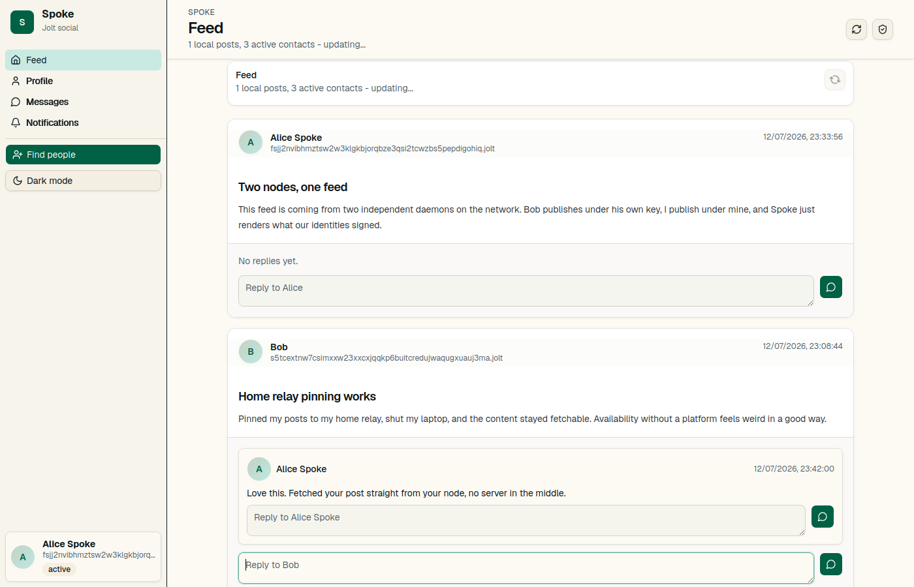

# Spoke

Spoke is a small social app built on
[Jolt](https://github.com/alexanderwanyoike/jolt): profiles, posts, a feed of
known identities, and encrypted replies. It exists to prove that a third-party
app can deliver a real social experience without owning identity,
distribution, or the user's keys. Spoke never sees a private key; it requests
scoped capabilities from the local Jolt daemon, and the user approves or
revokes that session in Jolt Console.



*Two identities on two independent daemons: each post is signed content
fetched from the identity that authored it, and the reply traveled between
nodes as an encrypted object through recipient-controlled ingress.*

What Spoke exercises at the Jolt boundary:

- scoped app sessions (capability grants approved and revoked in Console);
- posts as append records, discovered by enumerating each author's identity;
- an encrypted contact graph (follow edges encrypted to the owner);
- encrypted replies delivered through recipient-controlled ingress.

Spoke keeps social concepts in app-owned JSON objects under `/spoke/*`:

- `/spoke/profile` for the local display profile
- `/spoke/posts/{id}` for public posts (append records)
- `/spoke/contacts/{identity}` for encrypted follow edges
- `/spoke/outgoing/{id}` for encrypted outbound reply envelopes
- `/spoke/replies/{id}` for accepted incoming replies

The Jolt protocol knows nothing about any of these: posts, profiles, contacts,
and replies are Spoke's application schema over Jolt's signed paths, append
records, encrypted envelopes, and ingress primitives.

## Run

Spoke is desktop-first. Run Jolt Console first and let it start the local Jolt
daemon, then open Spoke and approve Spoke's app session in Console.

Install or update Spoke from tagged Linux releases:

```sh
curl -fsSL https://raw.githubusercontent.com/alexanderwanyoike/spoke/main/scripts/install-spoke.sh | bash
```

The installer downloads `spoke-x86_64.AppImage` to:

```text
~/.local/bin/spoke
```

Check whether a newer release exists:

```sh
curl -fsSL https://raw.githubusercontent.com/alexanderwanyoike/spoke/main/scripts/install-spoke.sh | bash -s -- --check
```

Install a specific version:

```sh
curl -fsSL https://raw.githubusercontent.com/alexanderwanyoike/spoke/main/scripts/install-spoke.sh | SPOKE_VERSION=v0.1.0 bash
```

Check the installed AppImage:

```sh
spoke --appimage-help
```

macOS and Windows builds are distributed as release assets:

```text
spoke-aarch64.dmg
spoke-x86_64-setup.exe
```

Download the DMG or Windows installer from the latest GitHub Release. The macOS
DMG currently is not Apple-signed or notarized. If macOS says Spoke is damaged
and cannot be opened after copying it to Applications, clear the quarantine
attribute:

```sh
xattr -dr com.apple.quarantine "/Applications/Spoke.app"
```

Packaged Spoke builds also check GitHub Releases for signed in-app updates.
When a newer signed release is available, Spoke shows an update action in the
top bar. Installing the update verifies the updater signature, applies the
platform update payload, and relaunches Spoke.

## Desktop Development

```sh
npm install
npm run desktop:dev
```

Build the Linux AppImage:

```sh
npm run desktop:build
```

The AppImage is written to:

```text
src-tauri/target/release/bundle/appimage/Spoke_0.1.0_amd64.AppImage
```

For web development:

```sh
npm run dev
```

The Vite dev server listens on `http://127.0.0.1:5178` and proxies the local daemon from `VITE_JOLT_DAEMON_URL` or `http://127.0.0.1:9862`.

## Release Packaging

CI builds Linux AppImage, macOS DMG, and Windows NSIS artifacts for pull
requests and publishes release assets for tags:

```text
spoke-x86_64.AppImage
spoke-x86_64.AppImage.sha256
spoke-x86_64.AppImage.sig
spoke-aarch64.dmg
spoke-aarch64.dmg.sha256
spoke-aarch64.app.tar.gz
spoke-aarch64.app.tar.gz.sha256
spoke-aarch64.app.tar.gz.sig
spoke-x86_64-setup.exe
spoke-x86_64-setup.exe.sha256
spoke-x86_64-setup.exe.sig
latest.json
```

Packaged Spoke updates are signed and verified before installation. Spoke uses
its own updater key, separate from Jolt Console and Pastey.

## Local demo shape

1. Start a Jolt daemon and Jolt Console.
2. Open Spoke and request app access.
3. Approve the Spoke session in Console.
4. Publish a profile and a post.
5. Add a known contact by `.jolt` identity.
6. Refresh the feed and send an encrypted reply to a contact post.
7. On the recipient Spoke instance, refresh Incoming, open the ingress item, then accept or reject it.

The current reply flow uses existing daemon APIs only: Spoke encrypts and publishes an outgoing object under the sender's `/spoke/outgoing/*`, fetches the encrypted bytes by CID, then submits those bytes to the recipient daemon `/api/v1/ingress`.
