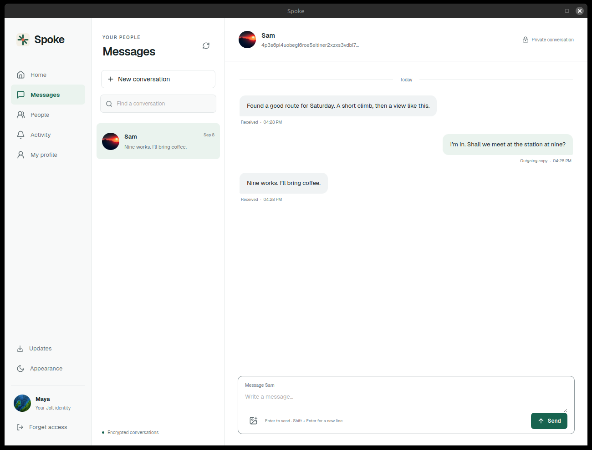

# Spoke

Posts, profiles and private conversations, built on [Jolt](https://github.com/alexanderwanyoike/jolt).

Share text, photos and links, follow people you know, and send encrypted messages.
Your Jolt node holds your identity keys. Spoke uses the permissions you approve in
Jolt Console.


## Get started

1. Install and open [Jolt Console](https://github.com/alexanderwanyoike/jolt/releases/latest).
2. Download Spoke for your computer and open it.
3. Approve Spoke in Jolt Console, then use **People** to find someone by their Jolt identity.

| Linux                                                                                                                                                                                               | macOS (Apple silicon)                                                                        | Windows                                                                                                 |
| --------------------------------------------------------------------------------------------------------------------------------------------------------------------------------------------------- | -------------------------------------------------------------------------------------------- | ------------------------------------------------------------------------------------------------------- |
| [.deb](https://github.com/alexanderwanyoike/spoke/releases/latest/download/spoke-amd64.deb) · [AppImage](https://github.com/alexanderwanyoike/spoke/releases/latest/download/spoke-x86_64.AppImage) | [DMG](https://github.com/alexanderwanyoike/spoke/releases/latest/download/spoke-aarch64.dmg) | [Installer](https://github.com/alexanderwanyoike/spoke/releases/latest/download/spoke-x86_64-setup.exe) |

On Debian, Ubuntu or Linux Mint, install the `.deb` with `sudo apt install ./spoke-amd64.deb`.
AppImage, macOS and Windows builds support signed in-app updates; `.deb` users install
the next package manually. macOS builds are not yet Apple-signed or notarized. See the
[install guide](docs/installation.md) for installer commands and troubleshooting.

<details>
<summary>Private conversations</summary>



People accept your contact request before you can exchange messages. Messages and
attached images are encrypted. Delivery depends on the recipient's node being reachable.

</details>

## Develop

With Jolt running, install dependencies and start the native app:

```sh
yarn install --frozen-lockfile
yarn desktop:dev
```

You need Rust, Node.js and the [Tauri prerequisites](https://v2.tauri.app/start/prerequisites/).
For browser development, use `yarn dev`. Set `VITE_JOLT_DAEMON_URL` to use a node
other than the default `http://127.0.0.1:9862`.

```sh
./scripts/test-local.sh
JOLT_BINARY=/absolute/path/to/jolt yarn test:integration
```

The integration tests start disposable nodes and cover messages, profiles, posts
and replies. They do not use your personal identity.

[Architecture](docs/CONTEXT.md) · [Source layout](src/README.md) · [Releases](https://github.com/alexanderwanyoike/spoke/releases) · [Screenshot credits](docs/assets/README.md)

Spoke is early software. Expect rough edges. MIT licensed.
