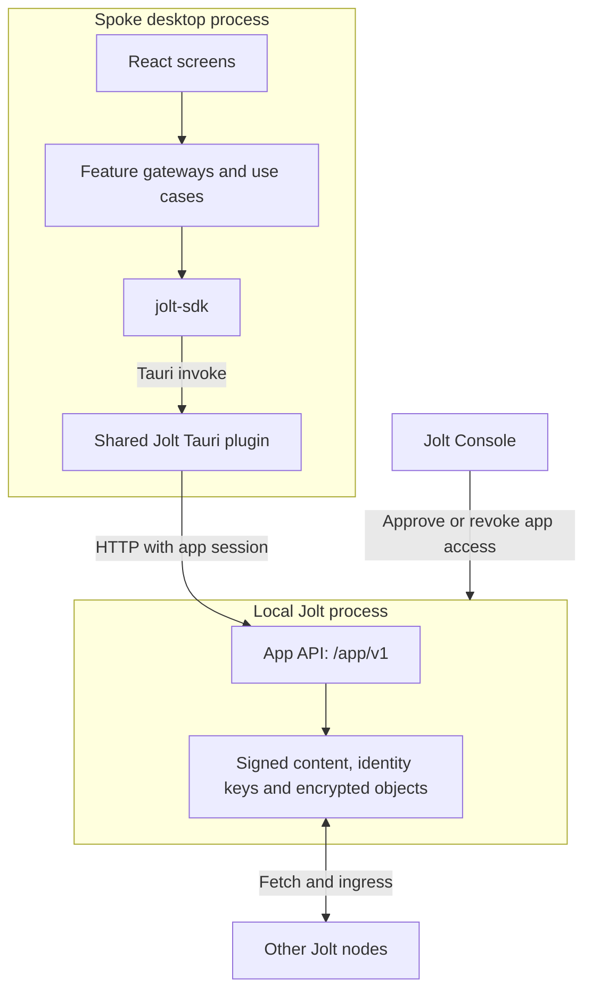
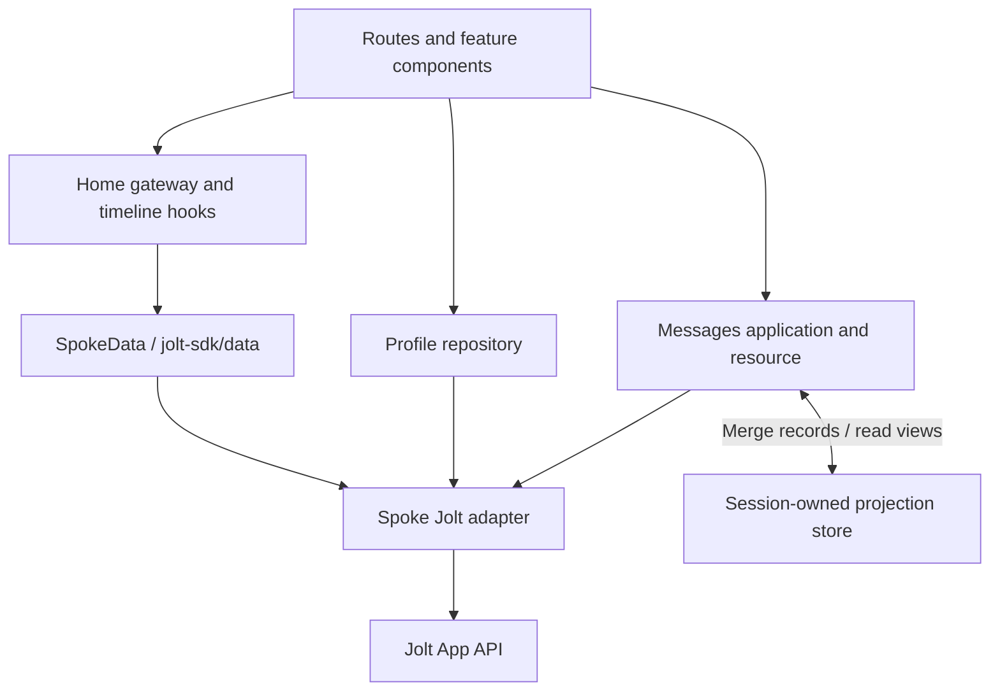
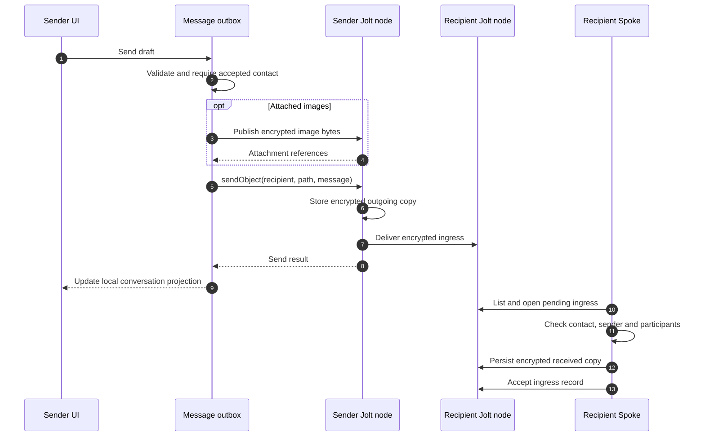

# Spoke architecture

Spoke owns profiles, posts, contacts, replies and conversations. Jolt stores and
signs their data, checks app permissions, fetches content and handles encrypted
delivery. Identity private keys stay in the node.

This guide describes the current application. Start with the runtime diagram,
then use the source map to find the feature you want to change.

## Runtime boundary

[`src/jolt/index.ts`](../src/jolt/index.ts) chooses the transport once. Desktop
calls use the shared Tauri plugin; browser development uses HTTP through the Vite
proxy. Both reach the same App API. Spoke's adapter restricts writes to
`/spoke/`; Jolt independently checks the approved session capabilities.

[`ConnectionBoundary`](../src/connection/ConnectionBoundary.tsx) restores and
checks the saved session before mounting the signed-in application. The runtime
is recreated when the identity or token changes, so private conversation state
belongs to that session.

## Where the code lives

[`app/App.tsx`](../src/app/App.tsx) composes the shell, session providers and
routes. [`app/runtime.ts`](../src/app/runtime.ts) constructs dependencies and
connects cross-feature effects, such as recording an accepted contact in Activity.
Feature modules own their workflows and presentation.

| Folder under `src/`                                              | Responsibility                                               |
| ---------------------------------------------------------------- | ------------------------------------------------------------ |
| [`app/`](../src/app/)                                            | Routes, shell and runtime composition                        |
| [`connection/`](../src/connection/)                              | Session restoration, approval and connection state           |
| [`home/`](../src/home/), [`feed/`](../src/feed/)                 | Post editing, typed post data and timeline assembly          |
| [`profile/`](../src/profile/)                                    | Profile reads/edits, display names and shared avatars        |
| [`contacts/`](../src/contacts/), [`follow/`](../src/follow/)     | People screen, contact requests and relationship records     |
| [`message/`](../src/message/)                                    | Conversation state, send/receive workflows and message media |
| [`replies/`](../src/replies/), [`thread/`](../src/thread/)       | Reply review, publication and thread assembly                |
| [`activity/`](../src/activity/)                                  | Activity records and presentation                            |
| [`jolt/`](../src/jolt/), [`media/`](../src/media/)               | SDK binding and public/encrypted media operations            |
| [`components/`](../src/components/), [`shared/`](../src/shared/) | Reusable controls and screen presentation                    |

## Data and state ownership

There are two data paths in the current app. Home connects to the typed
`SpokeData` application in [`data.ts`](../src/data.ts), which declares a profile
document and posts collection. The profile editor currently uses its own
repository over SDK record operations, including revision checks before saving.
Messaging and contact workflows use the SDK's encryption and ingress operations.

The [projection store](../src/common/store.ts) merges records by identity, path
and version. An incomplete read must not erase a known record or replace it with
an older version. It is a disposable view of durable data held by Jolt.

[`MessagesResource`](../src/message/resource.ts) owns polling and exposes snapshots
to React. It retains the previous data when refresh fails and distinguishes stale
data from a first-load failure. Profile names resolve separately, so a slow name
lookup does not block inbox refresh. The session-scoped
[avatar cache](../src/profile/avatars.ts) shares image requests and retains known
pictures during temporary failures; the UI hook owns Blob URL cleanup.

React Hook Form and Zod handle post, profile and message input. Local React state
holds UI concerns such as dialogs and drafts. Neither Redux nor Zustand is a
dependency. State ownership is split by feature and lifetime rather than routed
through one application store.

## Sending and receiving a message

[`send-workflow.ts`](../src/message/send-workflow.ts) reuses a prepared message and
uploaded attachments during retries in the current session. It is not a durable
offline outbox. A successful send is not a read receipt.
[`receive.ts`](../src/message/receive.ts) saves the recipient's copy before
accepting ingress. This ordering allows a later refresh to retry unfinished work.
Unreadable saved copies produce a non-blocking notice.

## Working on a feature

Keep validation and domain decisions in the feature's model, input schema or
workflow. Keep transport details in its gateway/repository. Components should
consume those interfaces and render the result. Existing features differ in how
much machinery they need; a simple screen does not require a controller class.

Start behavioral changes with the closest colocated test. Gateway fakes cover
failure and retry behavior without a node; the
[two-node integration runner](../scripts/test-messages-integration.mjs) checks
messages, profiles, posts and replies through actual Jolt nodes. Run
`./scripts/test-local.sh` before a code PR.

The [ADRs](adr/) preserve earlier design decisions. Some older domain modules and
compatibility readers remain in the tree; the diagrams above describe the mounted
application rather than claiming that all features have been migrated to one
uniform API. For the other side of the boundary, see the
[Jolt architecture guide](https://github.com/alexanderwanyoike/jolt/blob/dev/docs/architecture.md).
