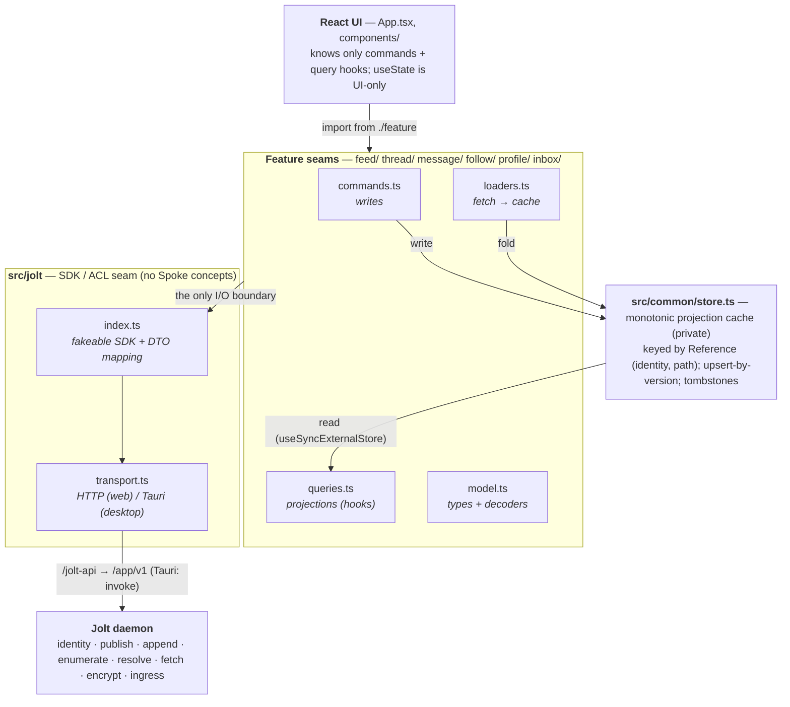
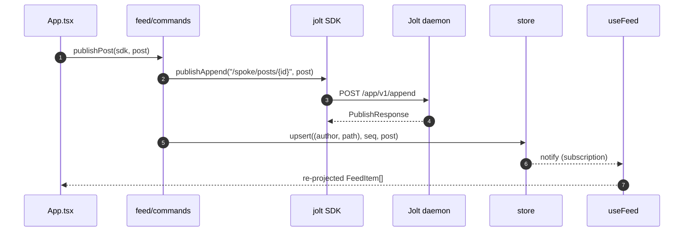
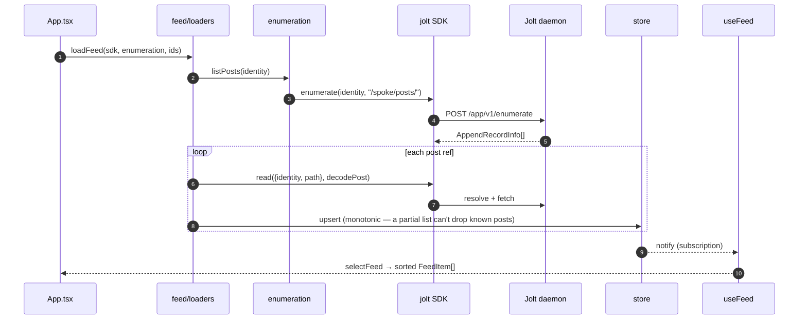

# Spoke architecture (`src/`)

Spoke is a social application built as a **replaceable view over content
published to the Jolt network**. Spoke owns every social concept (profiles,
posts, replies, threads, messages, follows). Jolt owns identity, signed
publishing, content-addressed fetch, encryption, and recipient-controlled
ingress. **Jolt never learns what a post, reply, or audience is.**

This file is the map. For the *why* behind the decisions, read
[`docs/CONTEXT.md`](../docs/CONTEXT.md) and the ADRs in
[`docs/adr/`](../docs/adr/); for the work history, the epic in
[`docs/cards/100-spoke-architecture-refactor-epic.md`](../docs/cards/100-spoke-architecture-refactor-epic.md).

## The one rule

> Durable signed publications on Jolt are the source of truth. React state is a
> disposable cache of *Projections* built from them. **A stale or incomplete
> read must never overwrite a newer confirmed write.**

Everything below exists to make that rule structurally impossible to break.

## Layered architecture

Each social feature is the **same four files doing the same four jobs**. Learn
one feature and you can read them all. A feature is moved into this layout as its
card is worked, not all at once.

## Data flow

### Write path (e.g. publish a post)

### Read path (e.g. load the feed)

Writes flow **down** through commands; reads come **up** through loaders → store
→ queries. Every feature works this way.

## Core concepts (glossary in miniature)

| Concept | What it is | Where |
|---|---|---|
| **Reference** | `(identity, path)` — the stable id of a publication. The store keys everything by this. | `src/jolt` |
| **Singleton Object** | "current value at a path", last-writer-wins. Fine for the profile. | `/spoke/profile` |
| **Append Record** | one element of a *growing* set; each is its own object at its own path so concurrent writers coexist. | posts, replies, messages, contact edges |
| **Collection** | every append record sharing a path prefix (e.g. all of an author's posts). | `/spoke/posts/`, `/spoke/accepted/{post}/` |
| **Enumeration** | listing a Collection. Done via Jolt's `enumerate` (J1). | `feed/enumeration.ts`, `thread/enumeration.ts` |
| **Projection** | a read-side view model folded from the store (a feed, a thread tree, a conversation). Derived, never authoritative. | `*/queries.ts` |
| **Monotonic store** | the cache: upsert-by-version, additive reads, removal only via tombstone. | `src/common/store.ts` |
| **Tombstone** | an append record marking another removed (un-accept, remove contact). The only way a record leaves a Projection. | store entries with `tombstone: true` |
| **Tolerant readers** | every fetched object is `unknown` until a `Decoder` validates it; bad objects are skipped, never poison a Projection. | `*/model.ts` decoders |

**The core rule of thumb:** anything that *grows* is an Append Record, never a
rewritten Singleton. A singleton set-blob silently loses concurrent writes; a
Collection of append records does not. See
[`docs/adr/0001`](../docs/adr/0001-append-records-not-rewritten-singletons.md).

## The Jolt SDK seam (`src/jolt/`)

`index.ts` exposes a **fakeable** SDK, split into capability interfaces so a
feature depends only on what it uses (and tests pass a plain object):

- `JoltSdk` — `publishJson`, `read(ref, decode)` (public publications)
- `JoltEncryptedSdk` — `publishEncryptedJson`, `readEncrypted`, `listPublished`
- `JoltIngressSdk` — `sendObject`, `listPendingIngress`, `openIngress`, `acceptIngress`, `rejectIngress`
- `JoltAppendSdk` — `publishAppend`, `enumerate` (the J1 append-record door)

`createJoltSdk` implements all four and is where **ACL marshalling** happens: the
domain hands in a `Decoder<T>` and gets back a `Versioned<T>`; wire DTOs
(snake_case daemon fields like `AppendRecordInfo`) are mapped to domain shapes
(camelCase `EnumeratedRecord`) here, so transport field shapes never leak up.

`transport.ts` is the only module that talks to the daemon and is **app-agnostic**
(no Spoke types/namespaces). Spoke's session capabilities live in
[`src/session.ts`](./session.ts).

### How Spoke reaches the daemon

| Concern | Daemon route (`/app/v1`) | Transport fn |
|---|---|---|
| Session | `/sessions/request`, `/session` | `requestSession`, `getCurrentSession` |
| Public read | `/resolve` + `/fetch` | `read` (via `resolveAddress`, `fetchTarget`) |
| Publish (singleton) | `/publish` | `publishJson`, `publishBinary` |
| **Append (Collection)** | `/append` | `appendPublishJson` |
| **Enumerate (Collection)** | `/enumerate` | `enumerate` |
| Encrypted | `/encrypted/publish`, `/encrypted/decrypt` | `publishEncrypted*`, `readEncrypted` |
| Ingress (DMs/follows) | `/ingress/*` | `sendObject`, `listPendingIngress`, … |

On **web** these are `fetch` calls through the `/jolt-api` dev proxy; on
**desktop** they go through Tauri `invoke` commands in
[`../src-tauri/src/lib.rs`](../src-tauri/src/lib.rs) (`daemon_request`,
`daemon_publish_json`, `daemon_publish_bytes`, `daemon_append`).

## Features at a glance

| Folder | Owns | Notes |
|---|---|---|
| `profile/` | the profile Singleton | simplest case; `useProfile`/`useProfiles` |
| `feed/`    | posts + the timeline | posts are append records under `/spoke/posts/`; `useFeed` |
| `thread/`  | replies + author-anchored acceptance | replies live under the replier; accepted refs are append records under the author at `/spoke/accepted/{post}/`; `useThread` builds a nested tree (ADR 0002) |
| `message/` | direct messages | each message an append record; `useConversations` groups by conversation, direction by path prefix |
| `follow/`  | the contact graph | append records **encrypted to self** under `/spoke/contacts/` (ADR 0004); `useContacts` |
| `inbox/`   | the ingress door | `processInbox` lists pending ingress and dispatches to per-feature handlers (auto-accept vs manual review) |
| `media/`   | image attachments | encrypted binary publish + fetch |

### The inbox path (incoming DMs / follow requests / replies)

Jolt delivers these as encrypted **ingress** records, not public publications.
`inbox/index.ts → processInbox` opens each pending record, asks the registered
per-feature handlers (`inbox/handlers.ts`) to classify it (`auto` vs `manual`),
auto-applies the safe ones (e.g. a message from an accepted contact), and returns
the rest for the user to review. Accepting a record calls the same feature
command an auto-accept would, so both paths converge on one code path.

## Testing

Because every feature depends on the SDK *interface*, tests pass a small fake
object (a `Map`-backed stand-in) instead of a real daemon — no network, no Tauri.
Domain tests (`*/domain.test.ts`) exercise commands/loaders/queries against fakes;
transport wire calls are tested in `jolt/transport.test.ts`. The monotonicity
guarantees (a stale refetch can't drop a known record) are asserted directly.

## Where to start reading

1. `src/common/store.ts` — small; it's the heart of the rule.
2. `src/jolt/index.ts` — the seam every feature talks to.
3. `src/feed/` — the simplest full read+write feature (4 files).
4. Then `thread/`, `message/`, `follow/`, `inbox/` as variations on the same shape.
